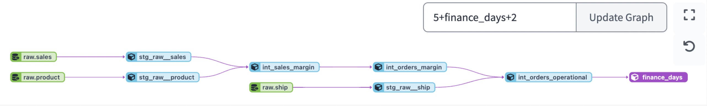
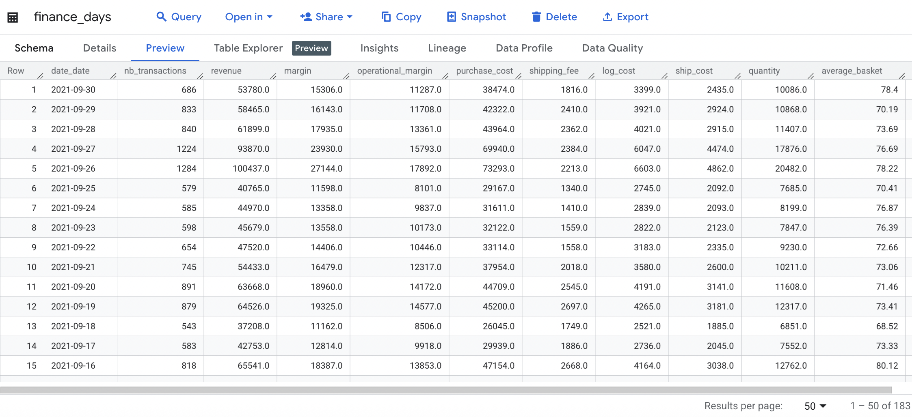
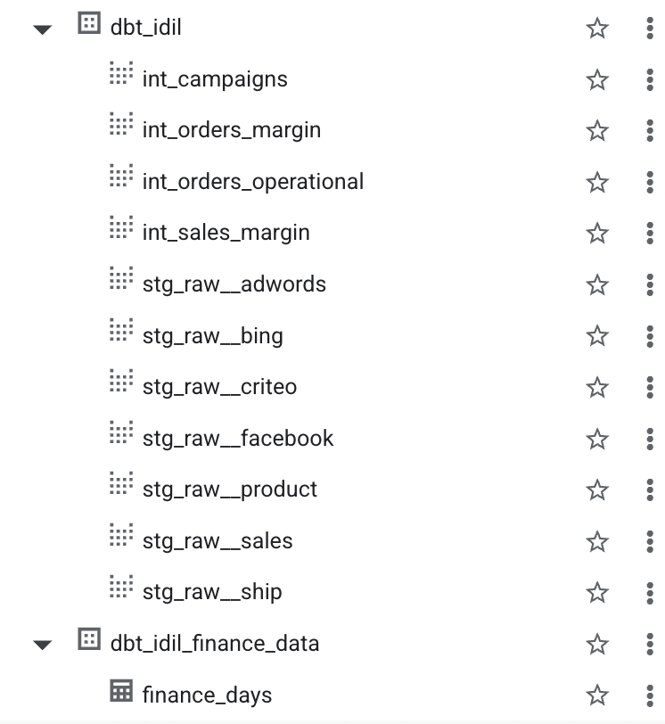

# Greenweez Analytics – dbt Pipeline

## 📌 Overview
This repository was created for the **Greenweez Analytics – dbt Pipeline project** completed during Le Wagon’s Data Analytics Bootcamp. The goal was to build a complete analytics pipeline for Greenweez sales, products, and shipping data in BigQuery, following dbt best practices.

## 🎯 Objectives
- Connect raw BigQuery tables as **sources**.
- Build clean **staging models**.
- Create **intermediate models** to compute margins and operational metrics.
- Deliver a **mart table** for Finance with daily KPIs.
- Add **tests and documentation** in `schema.yml`.

## 🗂️ Project Structure
- `models/sources/` → `schema.yml` defining sources & tests.
- `models/staging/` → cleaned views of raw tables.
- `models/intermediate/` → business logic (margin calculations).
- `models/mart/` → gold layer for Finance.

## 🛠️ Main Models

| Layer | Model | Description |
|-------|-------|-------------|
| **Sources** | `schema.yml` | Aliases for `gz_raw_data`: `sales`, `product`, `ship` |
| **Staging** | `stg_raw__sales.sql` | Clean sales table (renames `pdt_id`, keeps needed cols) |
| | `stg_raw__product.sql` | Cast `purchase_price` to FLOAT64 |
| | `stg_raw__ship.sql` | Keep `shipping_fee`, cast `ship_cost` |
| **Intermediate** | `int_sales_margin.sql` | Purchase cost & margin per product |
| | `int_orders_margin.sql` | Revenue, qty, margin per order |
| | `int_orders_operational.sql` | Operational margin (joins shipping fees & costs) |
| **Mart** | `finance_days.sql` | Daily KPIs: transactions, revenue, avg basket, op. margin |

### 📸 Screenshots

| Lineage Graph | Finance Table | Dataset Structure |
|---|---|---|
|  |  |  |

## ✅ Testing & Docs
- Uniqueness & `not_null` tests for all PKs and key columns.
- Combination uniqueness for `sales` (`orders_id || pdt_id`).
- Model & column descriptions in `schema.yml` allow `dbt docs generate`.

## ▶️ How to Run
```bash
# install dbt + BigQuery adapter
pip install dbt-bigquery

# run all models & tests
dbt build

# generate docs
dbt docs generate
